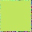
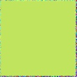

# Computer-Graphics-I3
This is the repository for the assignment "発展課題I3: Texture Synthesis".

# Explanation of my code
## `v1.py`
This is an implementation of texture synthesis with local region extension, based on the lecture slides pages 14 - 19 ("局所的な領域拡張による合成").

### Usage

I have run the code with `imgs/161.jpg`, which was taken from https://github.com/1iyiwei/texture/blob/master/data/161.jpg. (To avoid copyright issues, I have not included the image in this repository.) (This is a 64x64 image.)
You can try the same by:
1. Downloading the image from the link above and saving it as `imgs/161.jpg`.

2. Running the code with:
	```shell
	python v1.py
	```

3. The result will be saved as `imgs/161_128_reconstructed.jpg`.
	- There might be some other images of the intermediate results also saved in the `imgs/` directory.

NOTE:
To search for the best-matched neighborhood in the source image for each pixel in the generated (target) image, I have used a brute-force search. Therefore, it takes a very long time to generate the image.

### Results

Here are the results of the texture synthesis using local region extension:
- **64x64**
    
- **128x128**
    

### Discussion

During the texture synthesis process, several observations and potential issues were identified:

1. **Random Initialization Artifacts**:
    - The randomly initialized sections of the target image, i.e., the rightmost 2 columns and the bottommost 2 rows, are noticeably different from the source image. This discrepancy creates visually artifacts that are immediately detectable.

2. **Absence of Original Patterns**:
	- The synthesized image does not adequately reproduce the similar patterns present in the original image. This might be due to an incorrect implementation.
	- Related to this, one possible drawback of the algorithm is that an error in generating one pixel can propagate to subsequent pixels, as each pixel is generated based on its predecessors. 
